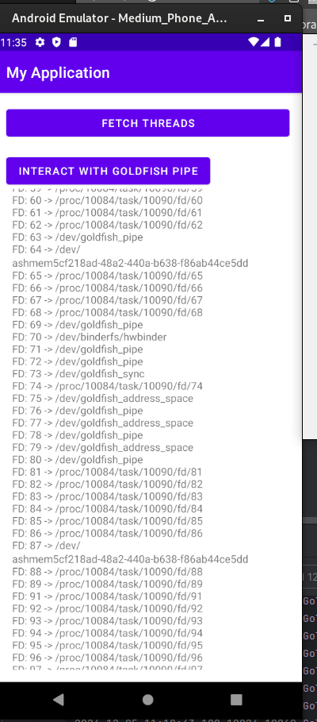

# Example app

example app that shows how to get the commands and process running in the same thread
space: https://man7.org/linux/man-pages/man5/proc_pid_comm.5.html

Also shows how to use the Threads to resolve FD's and get stack trace information about
threads, and opens/writes/reads to the goldfish pipe. You can build this or optionally just install the apk
located in the root directory. 

Example output: 

